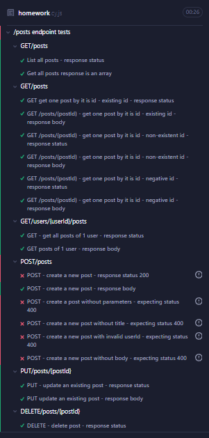
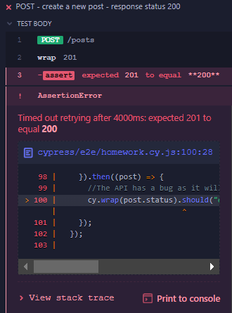
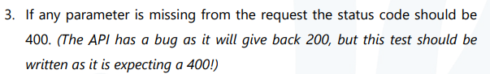
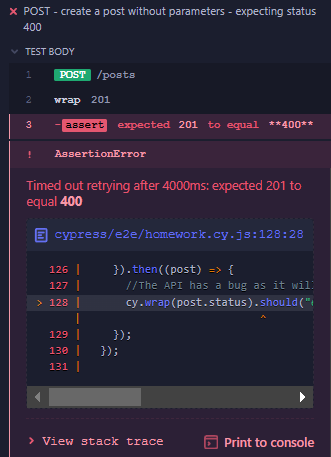
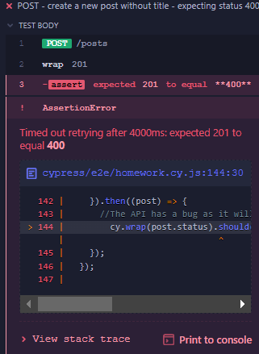
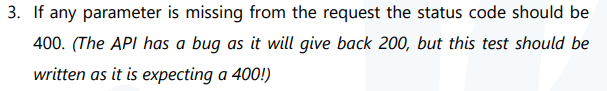
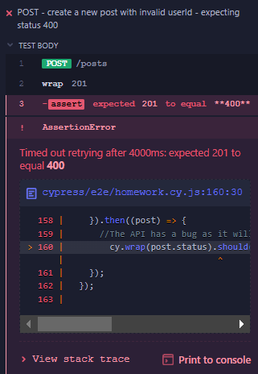
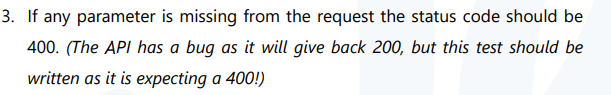
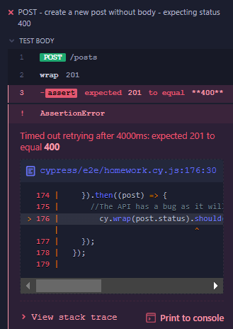

homework.cy.js result:

Bugs:

1. POST - create a new post - response status 200
Expected result:

Actual result:

2. POST - create a post without parameters - expecting status 400

Expected result:

Actual result:

3. POST - create a new post without title - expecting status 400

Expected result:

Actual result:

4. POST - create a new post with invalid userId - expecting status 400

Expected result:

Actual result:

5. POST - create a new post without body - expecting status 400

Expected result:

Actual result:

